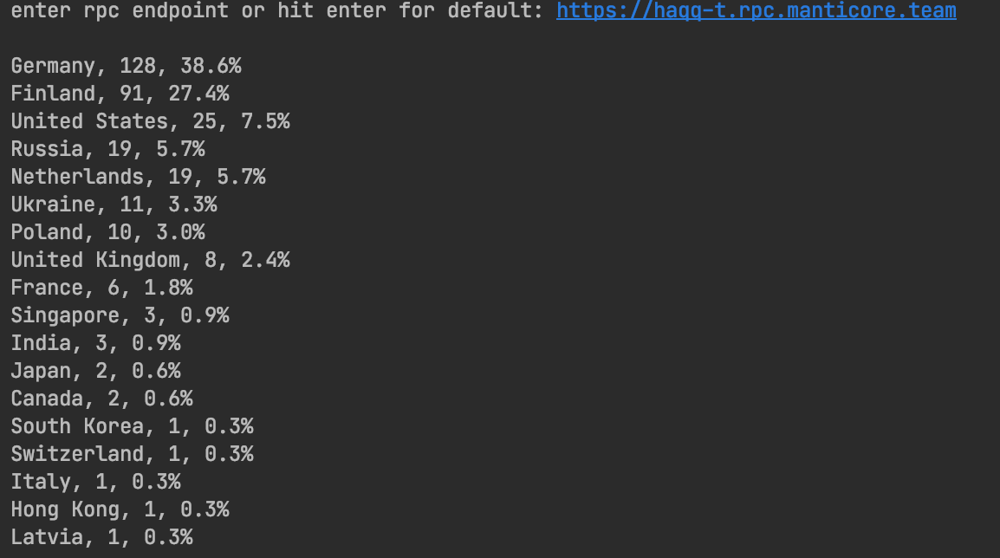

#Haqq geo locator

To get information about haqq network nodes country location:
 * Install `requests` and `geoip2` packages.
 * Run `app_runner.py` script and follow instructions

Example output

For location by ip identification [maxmind](https://www.maxmind.com) local `GeoLite2 Country` db is
used. This database is updated weekly and could be downloaded from your personal account to `$HAQQ_GEOLOCATOR_ROOT/maxmind` for more 
precise results.